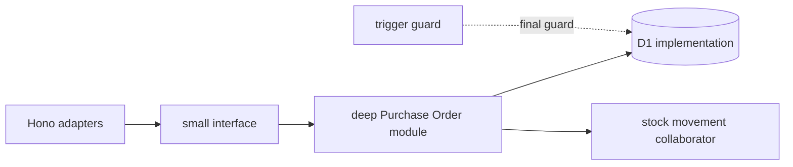
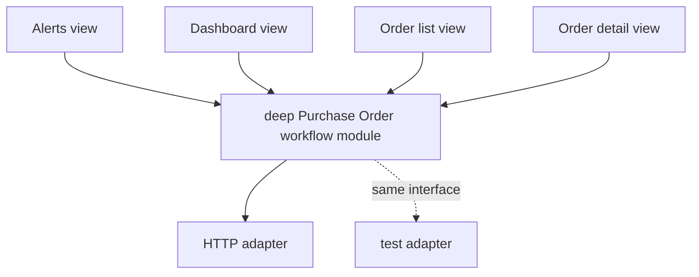
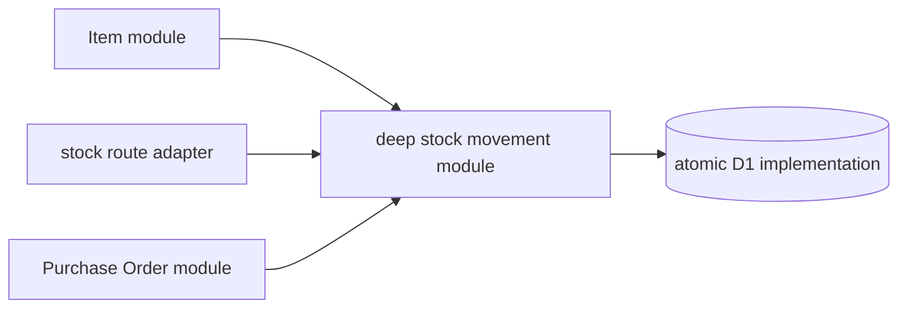
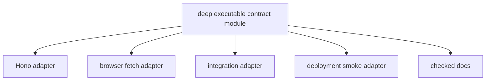
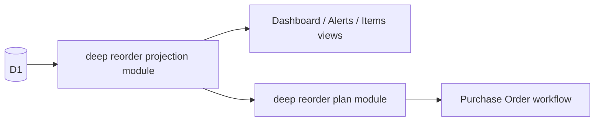

# Here-is-order 아키텍처 리뷰

작성일: 2026-07-12
방식: read-only 코드·문서·최근 변경 조사, deletion test 적용

## 기준선

> 아래 수치는 리뷰 작성 시점의 스냅샷으로, 후속 리팩터링이 반영된 현재 라인 수·테스트 수가 아닙니다.

| 항목 | 리뷰 시점 상태 |
| --- | ---: |
| Worker | `src/index.ts` 2,016줄 |
| 발주 상세 화면 | 851줄 |
| integration test | 9개 |
| frontend test | 0개 |
| 검증 | `test`, `typecheck`, `web:lint` 통과 |

단순 파일 분할은 제외했습니다. interface와 invariant를 그대로 노출한 채 파일만 늘리면 shallow module이 되기 때문입니다.

## 1. 발주 생명주기 module 심화

**추천 강도:** Strong
**완료 상태:** Completed — deep Purchase Order module과 integration test 안전망으로 상태 규칙, D1 batch, domain error를 집중시켰습니다.
**Files:** `src/index.ts:1170-1948`, `migrations/002_integrity_and_roles.sql:118-164`, `test/api.integration.test.ts:96-343`, `docs/design/api-spec-v1.md:264-365`

### Problem

상태 전이, 발주 항목 병합, draft 제약, 충돌 감지, 감사로그가 route 분기·SQL 조건·trigger에 반복됩니다. 부분입고 implementation은 `purchase_orders`, `order_items`, `items`, `stock_transactions`, `audit_logs`를 한 번에 조정합니다.

### Solution

Hono adapter는 인증·파싱·직렬화만 맡기고, 하나의 deep Purchase Order module이 발주 의도부터 상태 규칙, D1 batch, domain error까지 소유합니다. D1만을 위한 가상 repository seam은 만들지 않습니다.

- locality: 상태 규칙이 한곳에 모임
- leverage: mutation route 여섯 곳이 사용
- interface 자체가 test surface가 됨
- 기존 동시 입고 test를 안전망으로 유지

**Deletion test:** module을 삭제하면 병합·상태·충돌·입고·감사 지식이 최소 여섯 caller에 다시 나타납니다.

## 2. 브라우저 발주 workflow module 심화

**추천 강도:** Strong
**Files:** `frontend/app/(app)/orders/page.tsx:124-225`, `frontend/app/(app)/orders/[id]/page.tsx:70-385`, `frontend/app/(app)/dashboard/page.tsx:87-153`, `frontend/app/(app)/alerts/page.tsx:84-92`, `frontend/lib/order-ui.ts`

### Problem

세 가지 발주 생성 흐름, raw status 비교, reload 순서, 오류 위치, URL handoff가 화면마다 다릅니다. 목록 화면은 모든 상태에 삭제 동작을 노출하지만 domain 규칙은 draft만 허용합니다. 알림 기반 생성은 발주서 생성과 품목 추가를 두 요청으로 처리하여 중간 실패 시 빈 초안이 남을 수 있습니다.

### Solution

view는 사용자 의도만 전달하고 deep workflow module이 action availability, 원자적 생성 흐름, payload 구성, mutation outcome, refresh, saved/dirty/leave 결정을 숨깁니다. Worker는 transaction invariant의 최종 권위를 유지합니다.

- locality: workflow가 한곳에 모임
- leverage: 네 view가 공유
- 발주 생성 원자성이 일관됨
- render 없이 orchestration test 가능

**Deletion test:** module을 삭제하면 lifecycle policy와 request orchestration이 네 view에 다시 퍼집니다. 현재 `order-ui.ts`는 삭제해도 작은 조건문만 돌아오는 shallow module입니다.

## 3. 재고 movement·ledger module 심화

**추천 강도:** Strong
**Files:** `src/index.ts:691-785`, `src/index.ts:925-1042`, `src/index.ts:1818-1948`, `test/api.integration.test.ts:135-195`, `test/api.integration.test.ts:345-466`

### Problem

“현재고와 재고 원장은 함께 변한다”는 invariant가 초기 재고, 수동 조정, 부분입고에 각각 구현됩니다. 어느 caller든 paired write를 놓치면 저장된 현재고와 원장이 어긋납니다.

### Solution

하나의 deep stock movement module이 IN/OUT/ADJUST 의미, 음수 방지, 원장 생성, 현재고 갱신, 감사 사실을 함께 소유합니다. 발주 입고는 동일 D1 transaction implementation 안에서 이를 조합합니다.

- locality: 핵심 재고 invariant 집중
- leverage: write path 세 곳
- delta와 음수 edge test 가능
- ledger drift 방지

**Deletion test:** module을 삭제하면 signed quantity와 paired-write 지식이 세 caller에 그대로 복원됩니다.

## 4. 실행 가능한 HTTP contract module

**추천 강도:** Strong
**완료 상태:** Completed — [Purchase Order HTTP Contract 구현 계획](superpowers/plans/2026-07-12-purchase-order-http-contract.md)에 따라 Worker·browser Adapter가 포터블 런타임 계약을 공유합니다.
**Files:** `src/index.ts:39-55`, `frontend/lib/types.ts:1-114`, `frontend/lib/api.ts:15-56`, `test/api.integration.test.ts`, `scripts/smoke-deployment.mjs:50-64`, `docs/design/api-spec-v1.md`

### Problem

Worker 응답 shape, 브라우저 type, integration test의 JSON cast, smoke 검사, 문서가 각각 진화합니다. 실제로 Worker가 보내는 Item과 Order Item 필드 일부가 브라우저 type에서 빠져 있습니다. `apiRequest<T>`는 runtime 검증 없이 JSON을 generic type으로 신뢰합니다.

### Solution

portable deep module이 canonical literal, 요청·응답 runtime validation, envelope decoding, path와 error 의미를 소유하게 합니다. type 파일만 옮기는 shallow module은 만들지 않습니다.

- locality: contract 변경이 한곳에 모임
- leverage: 다섯 caller가 사용
- malformed response 조기 차단
- test의 local cast 제거

**Deletion test:** module을 삭제하면 path·literal·validation·envelope·error shape가 최소 다섯 caller에 재분산됩니다. Hono, browser fetch, deployment smoke는 이미 real seam의 adapters입니다.

## 5. 재주문 projection·plan 심화

**추천 강도:** Worth exploring
**Files:** `src/index.ts:636-688`, `src/index.ts:1044-1067`, `frontend/app/(app)/dashboard/page.tsx:87-264`, `frontend/app/(app)/alerts/page.tsx:58-92`, `frontend/app/(app)/items/page.tsx:304-312`, `frontend/lib/format.ts:3-13`

### Problem

추천수량 SQL은 품목 목록과 대시보드에 복사되어 있지만 관련 test가 없습니다. 브라우저는 0으로 clamp된 추천수량을 이용해 진행 중 수량을 역산하므로 실제 outstanding quantity를 복원할 수 없습니다. 위험 기준도 `<= min_stock`과 `< min_stock`으로 갈립니다.

### Solution

reorder projection module이 부족 여부, 진행 중 수량, 추가 필요 수량, severity를 명시적으로 제공합니다. reorder plan module은 선택·검증·발주 handoff를 소유하고 URL을 임시 상태 저장소로 사용하지 않습니다.

- locality: 계산과 threshold가 한곳에 모임
- leverage: 세 view와 두 query caller
- outstanding quantity를 명시적으로 전달
- edge case test seam 확보

**Deletion test:** module을 삭제하면 계산·severity·선택·handoff가 세 view와 두 query caller에 다시 나타납니다.

## Top recommendation

**1번 발주 생명주기 module 심화는 완료했습니다.** 후속으로 [Purchase Order HTTP Contract 구현 계획](superpowers/plans/2026-07-12-purchase-order-http-contract.md)에서 발주 HTTP contract characterization, 상세 합계 보정, Worker·browser 런타임 검증을 완료했습니다. 다음 구조적 후보는 2번 브라우저 발주 workflow module이며, 새 구현은 별도 계획과 안전망으로 진행합니다.
