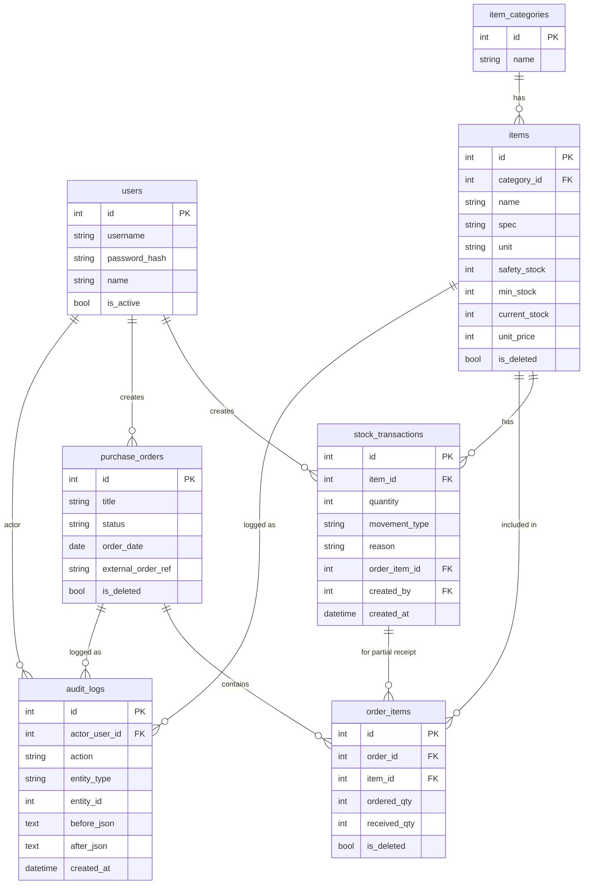

# ERD (MVP)

```mermaid
erDiagram
    users ||--o{ stock_transactions : "creates"
    users ||--o{ purchase_orders : "creates"

    item_categories ||--o{ items : "has"
    items ||--o{ stock_transactions : "has"
    items ||--o{ order_items : "included in"

    purchase_orders ||--o{ order_items : "contains"
    purchase_orders ||--o{ audit_logs : "logged as"

    items ||--o{ audit_logs : "logged as"
    stock_transactions ||--o{ order_items : "for partial receipt"

    users ||--o{ audit_logs : "actor"

    users {
        int id PK
        string username
        string password_hash
        string name
        bool is_active
    }

    item_categories {
        int id PK
        string name
    }

    items {
        int id PK
        int category_id FK
        string name
        string spec
        string unit
        int safety_stock
        int min_stock
        int current_stock
        int unit_price
        bool is_deleted
    }

    stock_transactions {
        int id PK
        int item_id FK
        int quantity
        string movement_type
        string reason
        int order_item_id FK
        int created_by FK
        datetime created_at
    }

    purchase_orders {
        int id PK
        string title
        string status
        date order_date
        string external_order_ref
        bool is_deleted
    }

    order_items {
        int id PK
        int order_id FK
        int item_id FK
        int ordered_qty
        int received_qty
        bool is_deleted
    }

    audit_logs {
        int id PK
        int actor_user_id FK
        string action
        string entity_type
        int entity_id
        text before_json
        text after_json
        datetime created_at
    }
```
