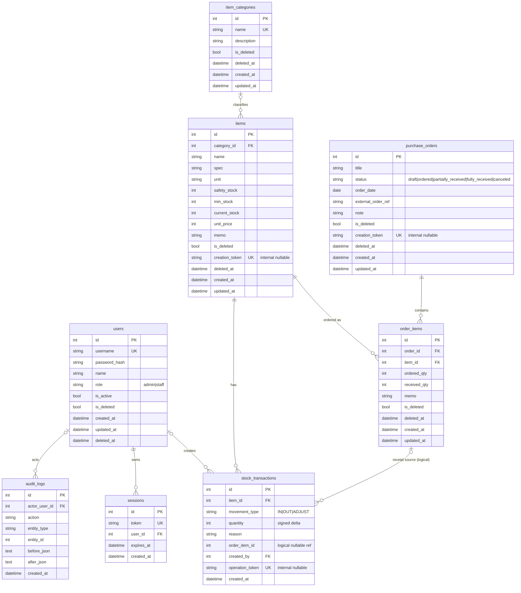

# ERD (MVP)

구현 스키마의 단일 source는 `migrations/`입니다. 아래 ERD는 `001_init.sql`과 후속 migration을 모두 적용한 상태를 나타냅니다.

## 관계 메모

- `purchase_orders`에는 `created_by`가 없으므로 `users → purchase_orders` 직접 관계가 없습니다. 변경 행위자는 `audit_logs.actor_user_id`로 기록합니다.
- `stock_transactions.order_item_id`는 부분입고가 어느 `order_items.id`에서 발생했는지 나타내는 nullable 논리 참조입니다. 물리적 FK는 없으며 migration과 reference snapshot 모두 trigger로 같은 품목의 활성 발주 항목인지 검증합니다.
- `created_by`와 `actor_user_id`는 nullable이므로 재고 원장과 감사로그는 사용자 없이 존재할 수 있습니다.
- `items.category_id`도 nullable입니다.
- 활성 발주서 안에서는 `(order_id, item_id)`가 유일합니다. 동일 품목을 여러 번 추가하면 별도 행을 만들지 않고 주문수량을 합칩니다.
- `creation_token`과 `operation_token`은 D1 batch 안에서 생성 행을 식별하기 위한 내부 임시값이며 API 응답 계약에 포함되지 않습니다.
